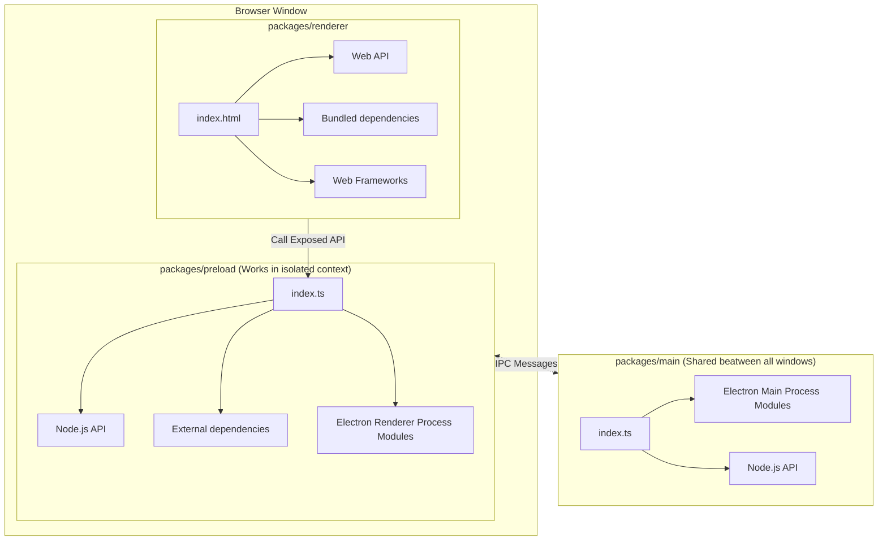
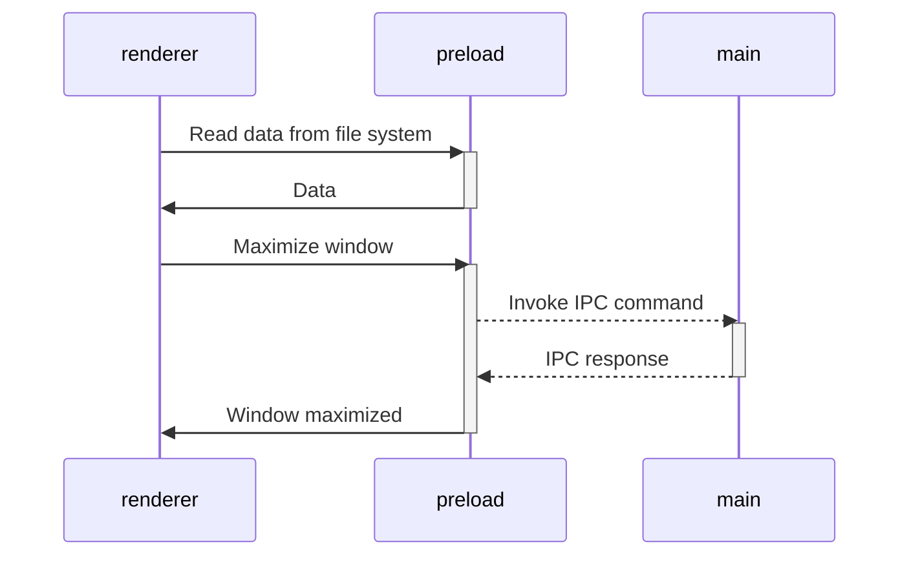

### Build web resources

The `main` and `preload` packages are built in [library mode](https://vitejs.dev/guide/build.html#library-mode) as it is
simple javascript.
The `renderer` package builds as a regular web app.

### Compile App

The next step is to package a ready to distribute Electron app for macOS, Windows and Linux with "auto update" support
out of the box.

To do this, use [electron-builder]:

- Using the npm script `compile`: This script is configured to compile the application as quickly as possible. It is not
  ready for distribution, it is compiled only for the current platform and is used for debugging.
- Using GitHub Actions: The application is compiled for any platform and ready-to-distribute files are automatically
  added as a draft to the GitHub releases page.

### Working with dependencies

Because the `renderer` works and builds like a _regular web application_, you can only use dependencies that support the
browser or compile to a browser-friendly format.

This means that in the `renderer` you are free to use any frontend dependencies such as Vue, React, lodash, axios and so
on. However, you _CANNOT_ use any native Node.js APIs, such as, `systeminformation`. These APIs are _only_ available in
a Node.js runtime environment and will cause your application to crash if used in the `renderer` layer. Instead, if you
need access to Node.js runtime APIs in your frontend, export a function form the `preload` package.

All dependencies that require Node.js api can be used in
the [`preload` script](https://www.electronjs.org/docs/latest/tutorial/process-model#preload-scripts).

#### Expose in main world
Here is an example. Let's say you need to read some data from the file system or database in the renderer.

In the preload context, create a function that reads and returns data. To make the function announced in the preload
available in the render, you usually need to call
the [`electron.contextBridge.exposeInMainWorld`](https://www.electronjs.org/ru/docs/latest/api/context-bridge). However,
this template uses the [unplugin-auto-expose](https://github.com/cawa-93/unplugin-auto-expose) plugin, so you just need
to export the method from the preload. The `exposeInMainWorld` will be called automatically.

```ts
// preload/index.ts
import { readFile } from 'node:fs/promises';

// Encapsulate types if you use typescript
interface UserData {
  prop: string
}

// Encapsulate all node.js api
// Everything you exported from preload/index.ts may be called in renderer
export function getUserData(): Promise<UserData> {
  return readFile('/path/to/file/in/user/filesystem.json', {encoding:'utf8'}).then(JSON.parse);
}
```

Now you can import and call the method in renderer

```ts
// renderer/anywere/component.ts
import { getUserData } from '#preload'
const userData = await getUserData()
```

> Find more in [Context Isolation tutorial](https://www.electronjs.org/docs/tutorial/context-isolation#security-considerations).

### Working with Electron API

Although the preload has access to all of Node.js's API, it **still runs in the BrowserWindow context**, so a limited
electron modules are available in it. Check the [electron docs](https://www.electronjs.org/ru/docs/latest/api/clipboard)
for full list of available methods.

All other electron methods can be invoked in the `main`.

As a result, the architecture of interaction between all modules is as follows:



> Find more in [Inter-Process Communication tutorial](https://www.electronjs.org/docs/latest/tutorial/ipc).

### Modes and Environment Variables

All environment variables are set as part of the `import.meta`, so you can access them vie the following
way: `import.meta.env`.

> **Note**:
> If you are using TypeScript and want to get code completion you must add all the environment variables to
the [`ImportMetaEnv` in `types/env.d.ts`](types/env.d.ts).

The mode option is used to specify the value of `import.meta.env.MODE` and the corresponding environment variables files
that need to be loaded.

By default, there are two modes:

- `production` is used by default
- `development` is used by `npm run watch` script

When running the build script, the environment variables are loaded from the following files in your project root:

```
.env                # loaded in all cases
.env.local          # loaded in all cases, ignored by git
.env.[mode]         # only loaded in specified env mode
.env.[mode].local   # only loaded in specified env mode, ignored by git
```

> **Warning**: 
> To prevent accidentally leaking env variables to the client, only variables prefixed with `VITE_` are exposed to your
Vite-processed code.

For example let's take the following `.env` file:

```
DB_PASSWORD=foobar
VITE_SOME_KEY=123
```

Only `VITE_SOME_KEY` will be exposed as `import.meta.env.VITE_SOME_KEY` to your client source code, but `DB_PASSWORD`
will not.

You can change that prefix or add another. See [`envPrefix`](https://vitejs.dev/config/shared-options.html#envprefix)

## Contribution

See [Contributing Guide](contributing.md).


[vite]: https://github.com/vitejs/vite/

[electron]: https://github.com/electron/electron

[electron-builder]: https://github.com/electron-userland/electron-builder

[vue]: https://github.com/vuejs/vue-next

[vue-router]: https://github.com/vuejs/vue-router-next/

[typescript]: https://github.com/microsoft/TypeScript/

[playwright]: https://playwright.dev

[vitest]: https://vitest.dev

[vue-tsc]: https://github.com/johnsoncodehk/vue-tsc

[eslint-plugin-vue]: https://github.com/vuejs/eslint-plugin-vue

[cawa-93-github]: https://github.com/cawa-93/

[cawa-93-sponsor]: https://www.patreon.com/Kozack/
